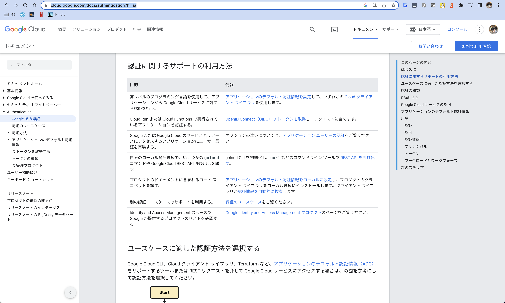
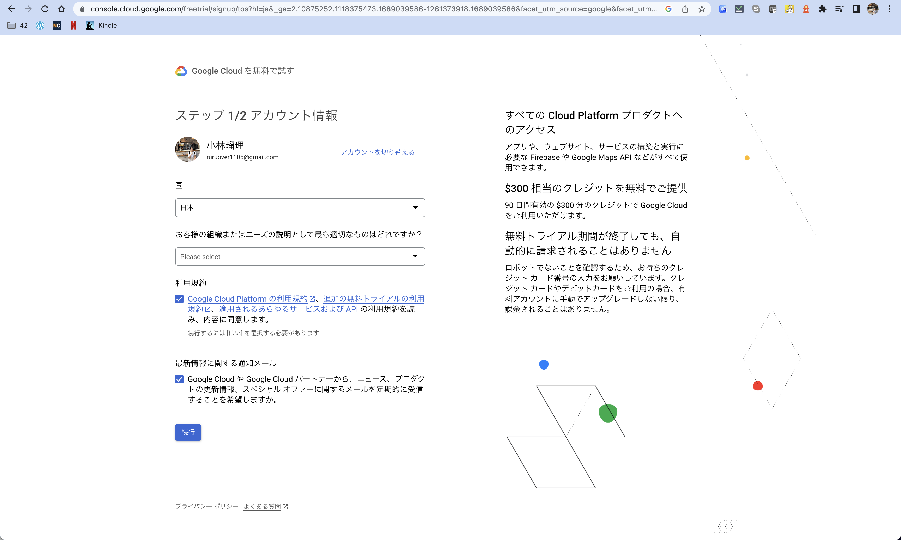
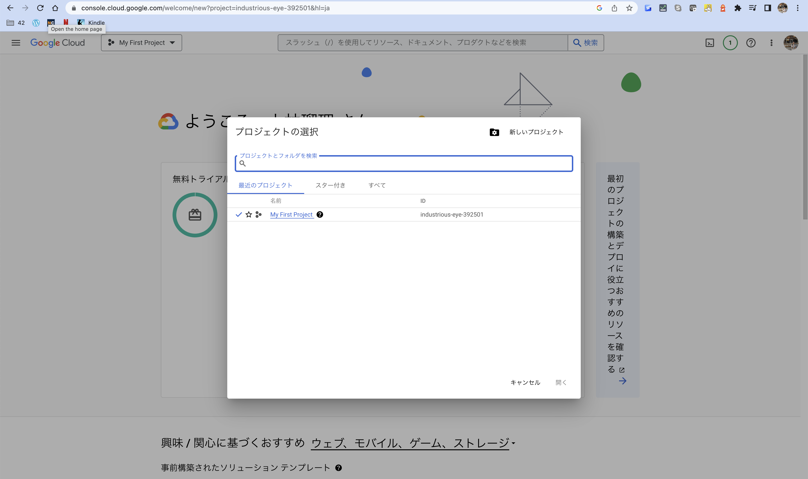
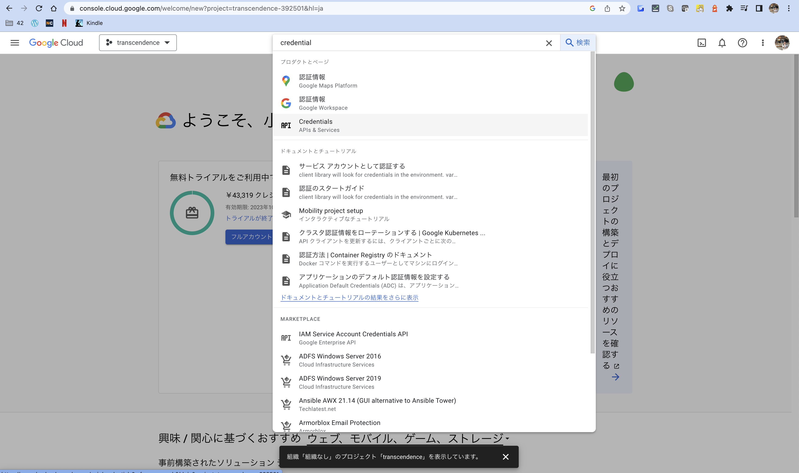
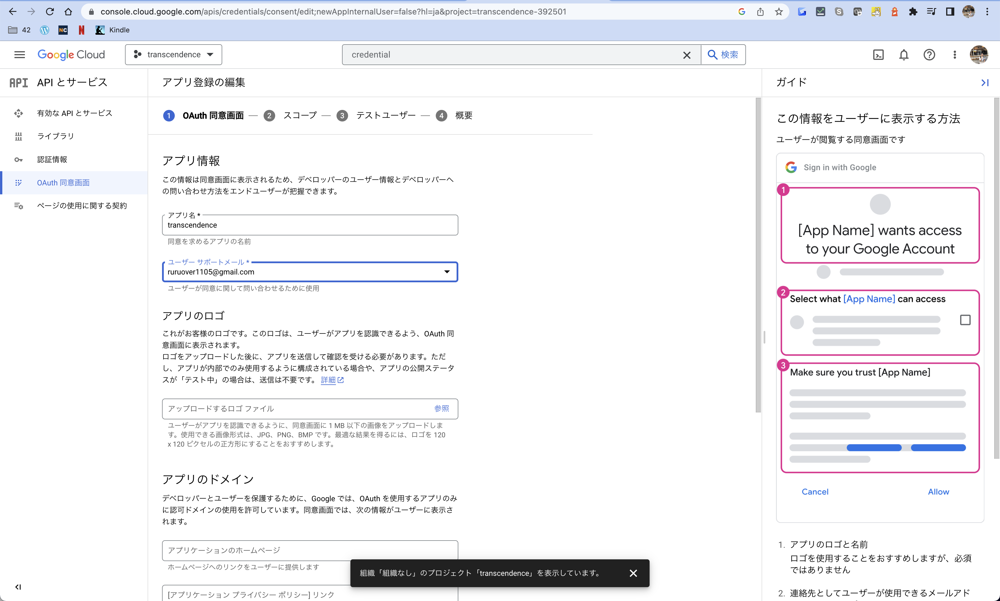
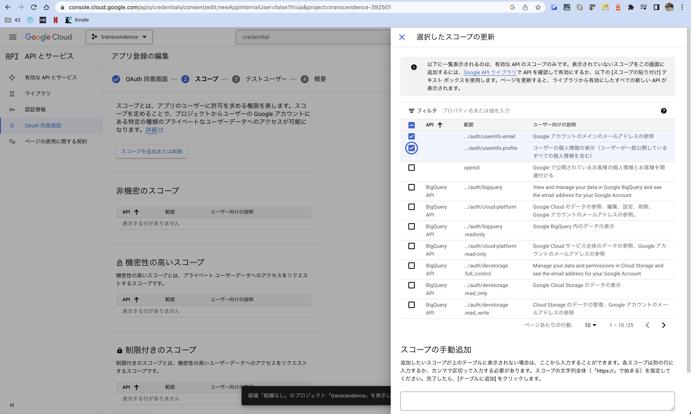
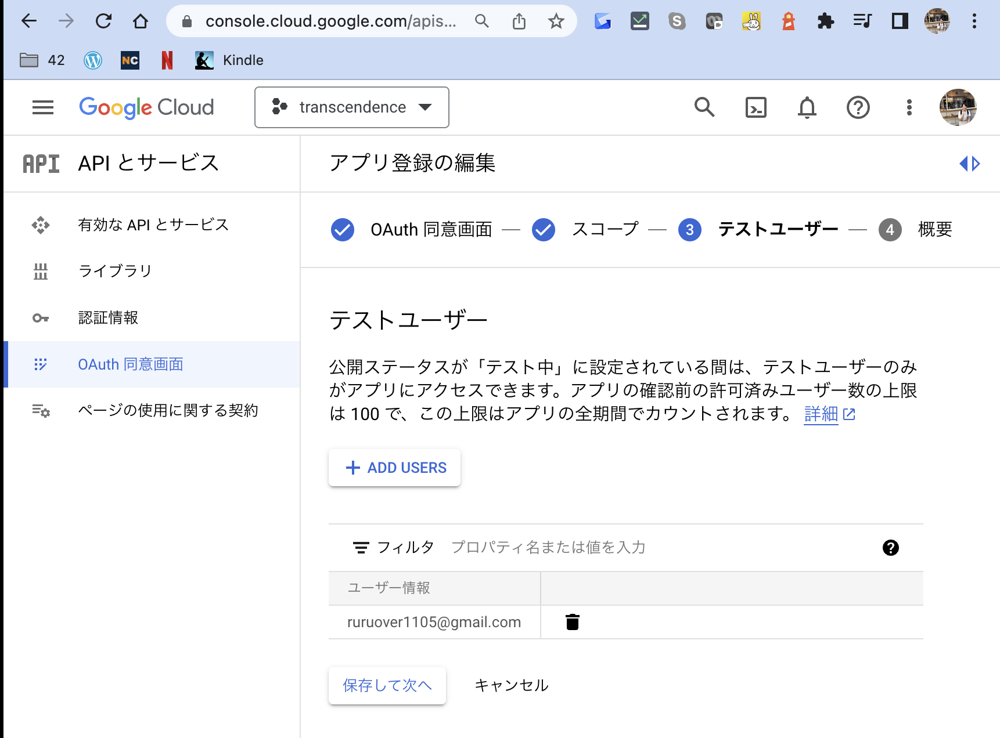
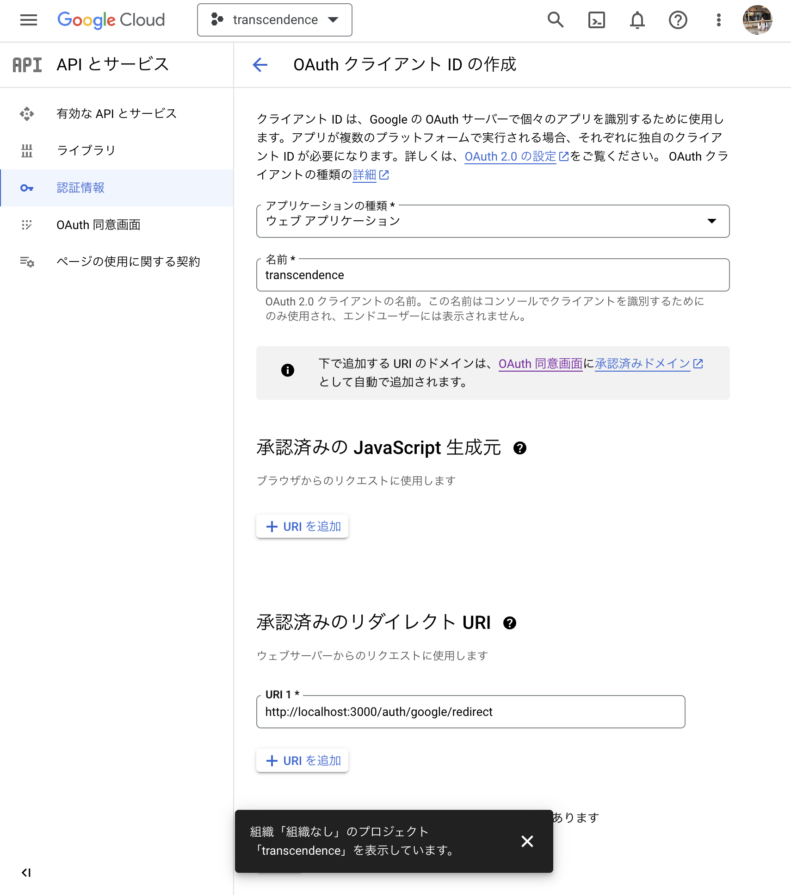

# ft_transcendence
## How to start project
```
# react
$ docker-compose exec front sh -c "yarn create vite <環境変数FRONT_PROJ_NAMEの値> --template react-ts"

# nest.js
$ docker-compose exec api sh -c "nest new <環境変数API_PROJ_NAMEの値> --package-manager yarn --skip-install --skip-git"
```
- [How to create project](https://qiita.com/katkatprog/items/a53fa97ba60fa361983a)

# front
## How to install MUI
```
frontのコンテナに入った上で行うこと
$ cd /workspace/front/react_app
$ npm install @mui/material @emotion/react @emotion/styled
$ npm install @mui/icons-material @mui/material @emotion/styled @emotion/react
$ npm install @mui/x-data-grid
```

## How to install Babel
```
frontのコンテナに入った上で行うこと
$ cd /workspace/front/react_app
$ npm install --save-dev @babel/core @babel/cli @babel/preset-env @babel/preset-react @babel/register
```

## version up npm
```
/workspace/front/react_app # npm update -g npm

removed 17 packages, changed 101 packages, and audited 251 packages in 10s

28 packages are looking for funding
  run `npm fund` for details

found 0 vulnerabilities
/workspace/front/react_app # npm -v
9.7.2
```

## react-router-dom
```
cd /workspace/front/react_app
npm install react-router-dom
```

## install socket
```
cd /workspace/front/react_app
npm install @types/socket.io-client
```

# back
## prisma
```
cd /nest_app/prisma
npx prisma studio
```
- after changing db table, pls drop table and migrate again
```
psql -h localhost -U postgres
password: yuhmatsu
DROP TABLE public."User" CASCADE;
exit
yarn prisma migrate dev
```

## install swagger
```
cd /workspace/api/nest_app
yarn add @nestjs/swagger swagger-ui-express
```

## install socket
```
cd /workspace/api/nest_app
yarn add @nestjs/websockets @nestjs/platform-socket.io
yarn add @types/socket.io
```

## install passport
```
cd /workspace/api/nest_app
yarn add @nestjs/passport passport passport-42 express-session
cd src
nest g module auth
nest g service auth
nest g controller auth
yarn add -D @types/express-session
```

## How to set up app in 42
- [create new app](https://profile.intra.42.fr/oauth/applications/new)
- [view created app](https://profile.intra.42.fr/oauth/applications/14601)


- set the below information in .env
```
ex.)
FORTY_TWO_ClIENT_ID=u-s4t2ud-f6da009c2bb9aa3bbf7649c21b5d92bb0ab92de284fad88bb099c7101f933480
FORTY_TWO_CLIENT_SECRET=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
FORTY_TWO_CALL_BACK_URL=/auth/redirect
```

- login url
  - http://localhost:3000/auth/login

## How ot set up app in Google Auth
- [enable google auth](https://cloud.google.com/docs/authentication?hl=ja)


1. 無料で利用開始ボタンを押下
2. 登録

3. 新しいプロジェクトを作成ボタンを押下

4. プロジェクト: transcendenceを作成
5. APIアイコンのcredentialsを検索

6. Oauth同意画面でUserType:外部を選択

7. アプリ名:transcendence、ユーザーサポートメール、ディベロッパーメールを入力

8. スコープにemail, profileを追加

9. testuserに自分のemailを追加

10. 認証情報からOauthクライアントIDを作成（アプリ：ウェブアプリケーション、名前：transcendence、承認済みリダイレクトURI：http://localhost:3000/auth/google/redirect）


```
{"web":{"client_id":"1074386836796-2pv7o3lutor8r15bl0lsoh5qav395d89.apps.googleusercontent.com","project_id":"transcendence-392501","auth_uri":"https://accounts.google.com/o/oauth2/auth","token_uri":"https://oauth2.googleapis.com/token","auth_provider_x509_cert_url":"https://www.googleapis.com/oauth2/v1/certs","client_secret":"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","redirect_uris":["http://localhost:3000/auth/google/redirect"]}}
```
